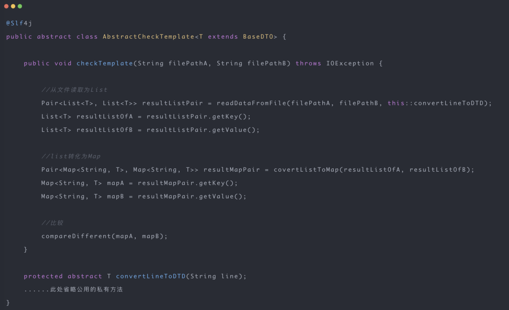
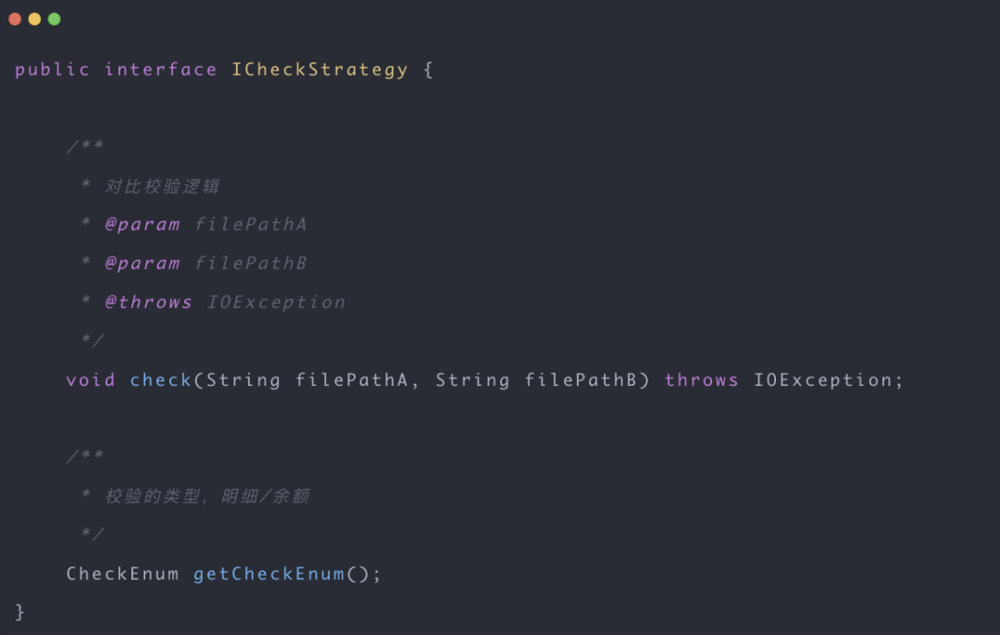

# ppfly-refactor-demo
重构-改善代码的既有设计
## accountChecking

### 0. 前沿
最近工作中,我通过层层优化重复代码,最后抽出个通用模板.因此跟大家分享一下优化以及思考的过程。我会先造一个相似的例子,然后一步步带大家如何优化哈,看完一定会有帮助的。
优化前的例子
* 第一步优化：抽取公用方法
* 第二步优化：反射对比字段
* 第三步优化：泛型+ lambda 函数式
* 第四步优化：继承多态
* 第五步优化：模板方法成型
* 大功告成: 策略模式+工厂模式+模板方法模式

### 1. 优化前的例子（old）
在这里,我先给大家模拟一个业务场景哈,并给出些简化版的代码

`假设你有个对账需求:你要把文件服务器中,两个A、B不同端，上送的余额明细和转账明细,下载下来,对比每个字段是否一致.`

明细和余额的对比类似,代码整体流程:

* 读取A、B端文件到内存的两个list
* 两个list通过某个唯一key转化为map
* 两个map字段逐个对比

### 2. 抽取公用方法去重（new1）
大家仔细看以上明细对比的例子,发现了重复代码:

我们可以抽取一个公用方法去优化它,比如抽取个读取文件的公用方法 readFile:

同理，这块代码也是重复了:

我们也可以抽个公用方法:convertListToMap

通过抽取公用方法后，已经优雅很多啦~

### 3. 反射对比字段（new2）
我们再来看下字段对比的逻辑，如下：

以上代码会取两个对象的每个字段对比，如果明细对象的属性字段特别多的话，这块代码也会显得重复冗余。我们可以通过反射去对比两个对象的属性，如下：

有了这个反射对比方法，原来的代码就可以优化成这样啦，是不是优雅了很多:

### 4. Lambda 函数式+泛型（new3）
实现完明细文件的对比,我们还需要余额文件的对比:

同样的,也是先读取文件,如下:

读取余额文件和刚刚的读取明细文件很像,有一部分代码是重复的,但是不能直接一下子抽个共同函数出来。

大家可以发现,就是一个返回类型,以及这个对应类型的一个静态 convert 方法不一致而已,如果是类型不一样,我们可以使用泛型替代,如果是一个小的静态方法不一致,我们则可以使用lambda函数式接口提取,因此可以抽这个这么一个公用方法吧:

平时我们用泛型+ Lambda 表达式结合，去抽取公用方法，代码就显得高端大气很多，对吧~

### 5. 继承多态(new4)
在余额对比文件中，读取完文件到内存后，我们需要把通过某个唯一key关联起来，即把List转为Map，如下：

因为余额和明细对比都有list转map的需求，而且也是有共性的，只不过是转化map的key和value的类型不一致而已

我们仔细思考一下，value类型是不同类型（分别是BalanceDTO 和 DetailDTO），而key则是对应对象的一个或者某几个属性连接起来的。对于不同类型，我们可以考虑泛型。对于余额和明细对象不同的key的话，我们则可以考虑继承和多态，让它们实现同一个接口就好啦。

我们可以使用继承和多态，定义一个抽象类BaseKeyDTO，里面有个getKey的抽象方法,然后BalanceDTO 和DetailDTO都继承它，实现各自getKey的方法，如下：

最后，我们应用继承多态+扩展泛型（<T extends BaseDTO>），就可以把余额和明细对比的convertListToMap方法抽成一个啦:

最后明细和余额对比，可以优化成这样，其实看起来已经比较优雅啦：

### 6. 模板方法(new5)
大家回头细看，可以发现不管是明细还是余额对比，两个方法很像，都是一个骨架流程来的：

* 读取A、B端文件到内存的两个list
* 两个list通过某个唯一key转化为map
* 两个map字段逐个对比

大家先回想一下模板方法模式：

`定义了一个算法的骨架，将一些步骤延迟到子类中实现。这有助于避免在不同类中重复编写相似的代码。`
#### 6.1 定义对比模板的骨架
我们可以尝试用模板方法优化它。我们先定义一个模板，然后模板内定义它们骨架的流程，如下:

#### 6.2 模板的方法逐步细化
因为readDataFromFile需要输出两个list，所以我们可以定义返回类型为Pair，代码如下：

又因为这个函数式的转化，是不同子类才能定下来的，我们就可以声明个抽象方法convertLineToDTD，让子类去实现。因此模板就变成这样啦：

同理，还有两个list转化为两个map再对比，我们可以声明为这样：

因此最终模板就是这样啦：

#### 6.3 不同对比子类
如果你是余额对比，那你声明一个CheckBalanceStrategyServiceImpl去继承抽象模板

如果你是明细对比，那你声明一个CheckDetailStrategyServiceImpl去继承抽象模板

这两个不同的子类，就像不同的策略，我们应该都能嗅到策略模式的味道啦~

### 7. 工厂模式+ 模板方法 + 策略模式全家桶(new6)
有了明细对比、余额对比的模板，为了更方便调用，我们还可以定义一个校验策略接口，然后交给spring工厂类，这样更方便调用。其实日常开发中，这三种设计模式一般一起出现，非常实用.

我们先声明一个校验ICheckStrategy接口:

然后模板AbstractCheckTemplate实现ICheckStrategy接口：

接着，不同对比策略类CheckDetailStrategyServiceImpl 和CheckDetailStrategyServiceImpl映射对应的对比校验类型:

最后一步，我们借助spring的生命周期，使用ApplicationContextAware接口，把对用的策略，初始化到map里面。然后对外提供checkCompare方法即可。让调用者决定用哪一种对比，其实这算工厂模式思想，大家可以自己思考一下~

### 7. 最后
本文介绍了：如何将一些通用的、用于优化重复冗余代码的技巧应用到开发中。最终，我通过这些技巧将代码优化成一个通用模板。很有实践的意义~
本笔记仅供自己学习使用，侵删~
[参考](https://mp.weixin.qq.com/s/5Gf-5jQBHuT-xa_NnoB_qg):https://mp.weixin.qq.com/s/5Gf-5jQBHuT-xa_NnoB_qg
